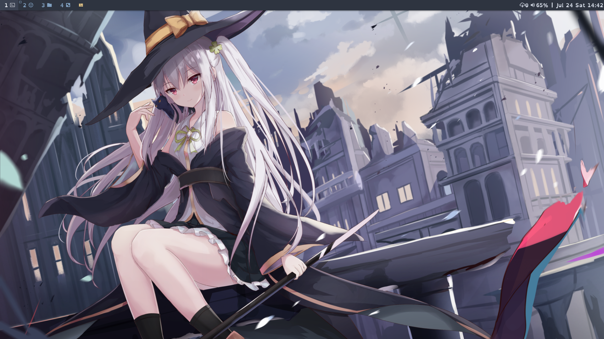

# Novaust's build of dwm

English | [简体中文](README_CN.md)

dwm is an extremely fast, small, and dynamic window manager for X.

BTW, I use dwm with my personal [scripts](https://github.com/Novaust/scripts).

## Screenshots

_(Wallpaper: [Pixiv Id=73317886](https://www.pixiv.net/artworks/73317886))_

## Requirements

In order to build dwm you need the Xlib header files.

So install `libxinerama` and `libx11` before compiling.

In addition, you may need a icon fonts like 
[Nerd Fonts](https://github.com/ryanoasis/nerd-fonts) (used in screenshot)
if you want to show icons in bar.

## Patches used

- [dwm-alwayscenter-20200625-f04cac6.diff](https://dwm.suckless.org/patches/alwayscenter/)
- [dwm-autostart-20161205-bb3bd6f.diff](https://dwm.suckless.org/patches/autostart/)
- [dwm-centretitle-20200907-61bb8b2.diff](https://dwm.suckless.org/patches/centretitle/)
- [dwm-colorbar-6.2.diff](https://dwm.suckless.org/patches/colorbar/)
- [dwm-fullscreen-6.2.diff](https://dwm.suckless.org/patches/fullscreen/)
- [dwm-noborderfloatingfix-6.2.diff](https://dwm.suckless.org/patches/noborder/)
- [dwm-pertag-6.2.diff](https://dwm.suckless.org/patches/pertag/)
- [dwm-scratchpads-20200414-728d397b.diff](https://dwm.suckless.org/patches/scratchpads/)
- [dwm-vanitygaps-20190508-6.2.diff](https://dwm.suckless.org/patches/vanitygaps/)

## Installation

Edit config.mk to match your local setup (dwm is installed into
the /usr/local namespace by default).

Afterwards enter the following command to build and install dwm (if
necessary as root): 

    make clean install 

## Running dwm

Add the following line to your `.xinitrc` to start dwm using startx:

    exec dwm

## Configuration

The configuration of dwm is done by creating a custom config.h
and (re)compiling the source code.

__Custom the information displaying in bar by using following commands:__

    xsetroot -name "<info>"

And you can write a cyclic script to display some dymanic infomations.
There is a shell script example:

    while true; do
        time=$(date "+%H:%M")
        xsetroot -name "$time"
        sleep 1
    done

