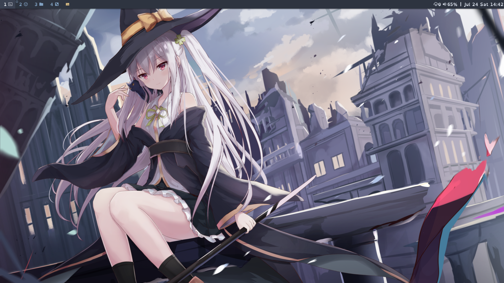

# 我的 dwm 构建

[English](README.md) | 简体中文

dwm 是基于 Xorg 的, 小巧快速的动态窗口管理器. 

顺带一提, 我将 dwm 与我的个人[脚本](https://github.com/Novaust/scripts)配合使用.

## 屏幕截图

_(壁纸: [Pixiv Id=73317886](https://www.pixiv.net/artworks/73317886))_

## 要求

为了构建 dwm , 你需要有 Xlib 头文件.

所以在编译之前请安装 `libxinerama` 和 `libx11`

此外, 如果你想在状态栏中显示图标, 你可能需要一款像 
[Nerd Fonts](https://github.com/ryanoasis/nerd-fonts) (截图中使用的)一样的图标字体

## 使用的补丁

- [dwm-alwayscenter-20200625-f04cac6.diff](https://dwm.suckless.org/patches/alwayscenter/)
- [dwm-autostart-20161205-bb3bd6f.diff](https://dwm.suckless.org/patches/autostart/)
- [dwm-centretitle-20200907-61bb8b2.diff](https://dwm.suckless.org/patches/centretitle/)
- [dwm-colorbar-6.2.diff](https://dwm.suckless.org/patches/colorbar/)
- [dwm-fullscreen-6.2.diff](https://dwm.suckless.org/patches/fullscreen/)
- [dwm-noborderfloatingfix-6.2.diff](https://dwm.suckless.org/patches/noborder/)
- [dwm-pertag-6.2.diff](https://dwm.suckless.org/patches/pertag/)
- [dwm-scratchpads-20200414-728d397b.diff](https://dwm.suckless.org/patches/scratchpads/)
- [dwm-vanitygaps-20190508-6.2.diff](https://dwm.suckless.org/patches/vanitygaps/)

## 安装

编辑 config.mk 文件来匹配你的本地设置(dwm 默认安装在 /usr/local).

然后通过一下命令构建并安装 dwm (以 root 权限运行):

    make clean install

## 运行 dwm

添加以下语句到你的 `.xinitrc` 并使用 startx 来启动 dwm:

    exec dwm

## 配置

dwm 的配置通过创建自定义的 config.h 文件并(重新)编译完成.

__通过以下命令来自定义状态栏显示的信息:__

    xsetroot -name "<info>"

也可以写一个循环脚本来显示动态信息.
以下是一个 shell 脚本的例子:

    while true; do
        time=$(date "+%H:%M")
        xsetroot -name "$time"
        sleep 1
    done

